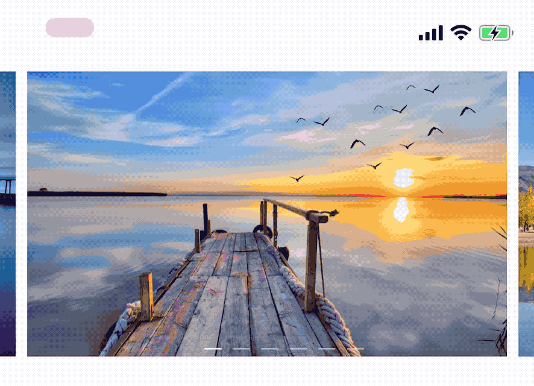

# HKBanner

[](https://travis-ci.org/Harley-xk/HKBanner)
[](http://cocoapods.org/pods/HKBanner)
[](http://cocoapods.org/pods/HKBanner)
[](http://cocoapods.org/pods/HKBanner)

Swift Banner component, supports remote images and infinite cycling.



## Install

CocoaPods Supported：

```ruby
# for swift 4.2
pod 'HKBanner'
```

## Usage

```swift
var options = BannerOptions(bannerInsets: UIEdgeInsets(top: 0, left: 15, bottom: 0, right: 15),
                                       pageInset: UIEdgeInsets(top: 0, left: 4, bottom: 0, right: 4),
                                       isCyclic: true)
// optional, set if needs auto scrolling
options.autoScrollDelay = 3

// optional, set if needs page indicator
let pageIndicator = DashPageIndicator()
options.pageIndicator = pageIndicator

// create banner view with options
let banner = Banner(options: options)
view.addSubview(banner)
banner.snp.makeConstraints {
    $0.top.equalToSuperview().inset(50)
    $0.left.right.equalToSuperview()
    $0.height.equalTo(200)
}

// set datasource
let imagePageVendor = ImagePageVendor(items: [
    "http://www.xxx.com/xxx.jpg",
    "http://www.xxx.com/xxx.jpg",
    "http://www.xxx.com/xxx.jpg",
    ...
    ]) { (index) in
        // handle tap action here
        print("Taped at index: \(index)")
    }

// display data
banner.reload(with: imagePageVendor)
```

Read the sample code for more details!

## Licence

MIT License

Copyright (c) 2019 Harley.xk

Permission is hereby granted, free of charge, to any person obtaining a copy
of this software and associated documentation files (the "Software"), to deal
in the Software without restriction, including without limitation the rights
to use, copy, modify, merge, publish, distribute, sublicense, and/or sell
copies of the Software, and to permit persons to whom the Software is
furnished to do so, subject to the following conditions:

The above copyright notice and this permission notice shall be included in all
copies or substantial portions of the Software.

THE SOFTWARE IS PROVIDED "AS IS", WITHOUT WARRANTY OF ANY KIND, EXPRESS OR
IMPLIED, INCLUDING BUT NOT LIMITED TO THE WARRANTIES OF MERCHANTABILITY,
FITNESS FOR A PARTICULAR PURPOSE AND NONINFRINGEMENT. IN NO EVENT SHALL THE
AUTHORS OR COPYRIGHT HOLDERS BE LIABLE FOR ANY CLAIM, DAMAGES OR OTHER
LIABILITY, WHETHER IN AN ACTION OF CONTRACT, TORT OR OTHERWISE, ARISING FROM,
OUT OF OR IN CONNECTION WITH THE SOFTWARE OR THE USE OR OTHER DEALINGS IN THE
SOFTWARE.
